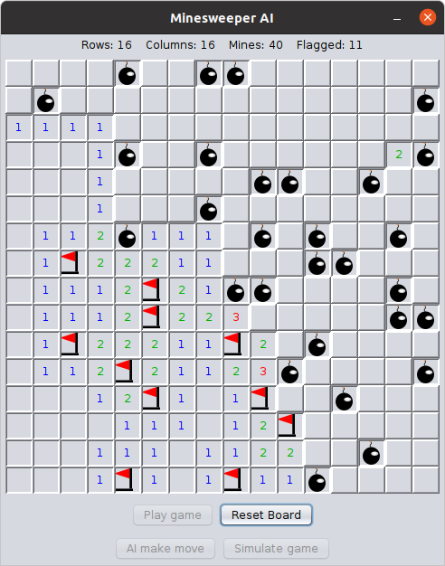

# Minesweeper Game with an AI
This is a Java implementation of the famous Minesweeper game. The icing on the cake is that it comes with an **AI** that can *play* Minesweeper. The AI works by **logically inferring** the safe cells to uncover, as well as the cells which definitely have a mine and thus can be flagged. When it has no more safe cells to uncover, it will *randomly* try to uncover a cell (this is when the AI loses). The AI has a **weighing scheme** to estimate the cell with the least probability of having a mine. The estimate is not always correct and the AI loses here. If it is correct, then the AI survives and plays on.

As of now, the AI performs well for the Beginner level, but flops in the Intermediate and Expert levels.

Older commits for the code can be found [here](https://github.com/RedDocMD/Minesweeper).
## Screenshot

## Building
To build this project, you need JDK 14 or higher and Apache [Maven](https://maven.apache.org/). Clone the repository and then run `mvn package` to build the JAR.
```
git clone https://github.com/RedDocMD/MinesweeperAI
cd MinesweeperAI
mvn package
```
## Running
To run this game, you can download the latest release [here](https://github.com/RedDocMD/MinesweeperAI/releases/tag/1.3). You will need Java 15 or higher to run this. The JAR file can be run as
```
java -jar MinesweeperAI-1.3.jar
```
The game can be played by a human by pressing the `Play Game` button. RIght click or left click will uncover a cell. **Control+Click** will set the flag. Double-clicking on a uncovered cell uncovers all the neighboring cells - though beware that if you haven't flagged all the mines, they will all blow.

To run the **AI**, press `AI make move`. The AI will then make one move. You cannot make moves in this mode. Pressing the button subsequently will make the AI make its next moves.

The `Reset` button will reset the board.

The `Simulate game` button is mainly used to test the AI's performance (which for the time being is dismal after the beginner level)